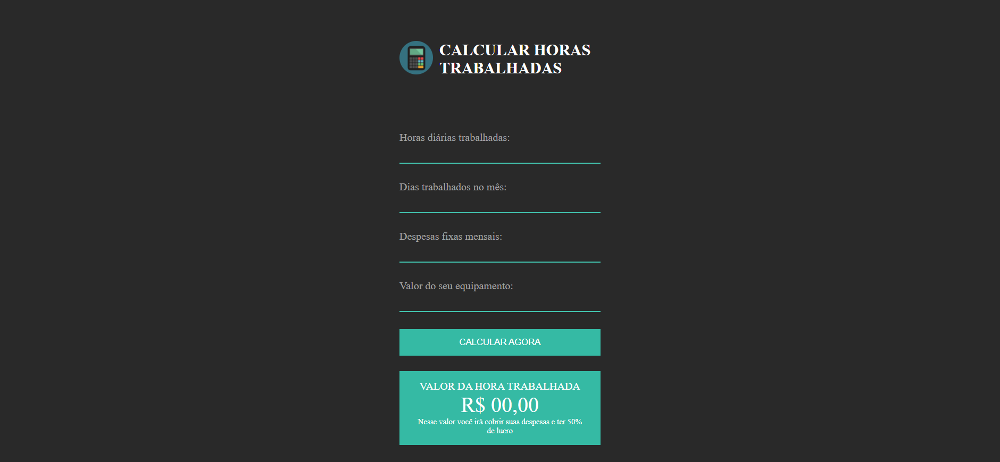

<h1 align="center"> Calculadora de Horas Trabalhadas </h1>

Projeto desenvolvido durante o webnário oferecido pela EBAC 

  <a href="#-tecnologias">Tecnologias</a>&nbsp;&nbsp;&nbsp;|&nbsp;&nbsp;&nbsp;
  <a href="#-projeto">Projeto</a>&nbsp;&nbsp;&nbsp;|&nbsp;&nbsp;&nbsp;
  <a href="#-layout">Layout</a>&nbsp;&nbsp;&nbsp;|&nbsp;&nbsp;&nbsp;
  <a href="#memo-licença">Licença</a>

  

 

  

## 🚀 Tecnologias

Esse projeto foi desenvolvido com as seguintes tecnologias:

- HTML e CSS
- JavaScript

## 💻 Projeto

Esse projeto apresenta uma calculadora simples de horas trabalhadas.

## 🔖 Layout

Você pode visualizar o layout do projeto através [DESSE LINK](https://www.figma.com/file/QcIVezUZharsUReJAf2nqA/Projeto-Live-EBAC?node-id=0%3A1&t=eIlU6bY7PV98ho4v-0). É necessário ter conta no [Figma](https://figma.com) para acessá-lo.

## :memo: Licença

Esse projeto está sob a licença MIT.

---

Feito por [Isa Kaillany](https://github.com/IsaKaillany)
